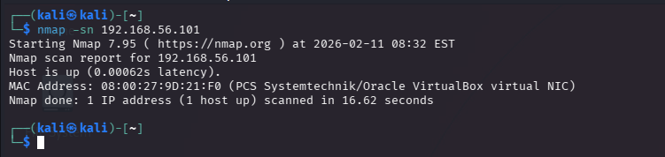
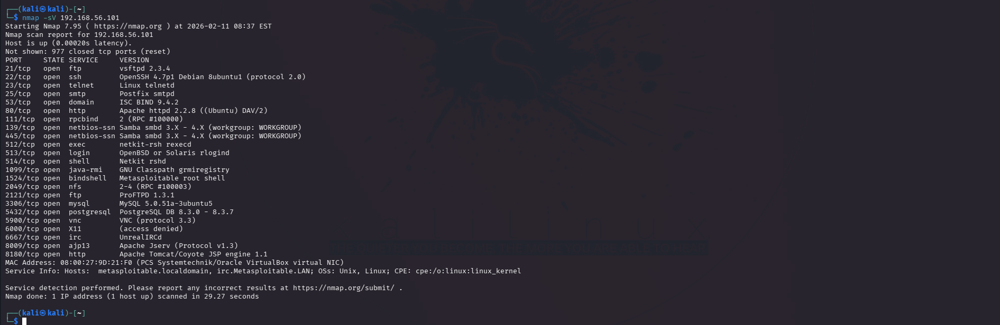
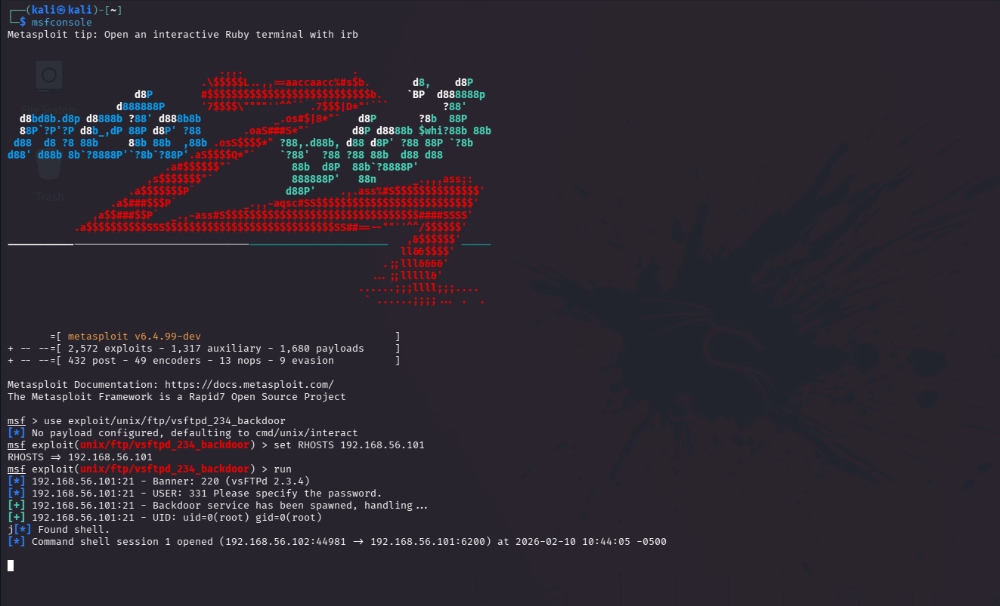

# Security Assessment Report

## 1. Executive Summary

This report documents a security assessment conducted against a deliberately vulnerable Linux system (Metasploitable2) within a controlled lab environment. The objective of the assessment was to identify exposed network services, analyze potential vulnerabilities, and validate the impact of selected high-risk findings.

The assessment identified multiple exposed services, including a critical vulnerability in the FTP service that allowed unauthenticated remote shell access. Additional weaknesses affecting service availability were also observed. All testing was performed ethically and safely for educational purposes.

---

## 2. Scope and Environment

**Scope:**

* One target host running Metasploitable2
* Network-based testing only
* No denial-of-service or destructive testing performed

**Environment:**

* Attacker Machine: Kali Linux (Virtual Machine)
* Target Machine: Metasploitable2 (Virtual Machine)
* Network Type: Isolated host-only / internal virtual network

---

## 3. Methodology

The assessment followed a structured penetration testing methodology:

1. Host discovery to confirm system availability
2. Full TCP port scanning to identify exposed services
3. Service and version enumeration
4. Vulnerability detection using Nmap NSE scripts
5. Risk analysis and prioritization
6. Controlled validation of one critical vulnerability using Metasploit
7. Documentation and reporting

---

## 4. Port and Service Enumeration

A full TCP port scan revealed multiple open services, including but not limited to:

* FTP (21)
* SSH (22)
* Telnet (23)
* HTTP (80)
* SMB (139, 445)
* Database services (MySQL, PostgreSQL)
* Remote management and legacy services

The large attack surface indicated significant exposure and a lack of service hardening.

---

## 5. Key Vulnerability Findings

### 5.1 Critical: vsFTPd 2.3.4 Backdoor (Port 21)

**Description:**
The FTP service was identified as running vsFTPd version 2.3.4, which contains a known backdoor vulnerability allowing unauthenticated remote command execution.

**Evidence:**

* Detected via Nmap service version detection
* Confirmed by Nmap NSE vulnerability scripts

**Impact:**
An attacker could gain remote shell access without authentication, leading to full system compromise.

**Validation:**
This vulnerability was successfully validated using the Metasploit Framework, resulting in a remote shell session. No further actions were performed beyond validation.

**Risk Level:** Critical

**Recommendation:**

* Remove or upgrade the vulnerable FTP service
* Disable FTP if not required
* Implement strict access controls and monitoring

---

### 5.2 Medium: Slowloris Denial-of-Service Risk (Port 80)

**Description:**
The HTTP service was identified as potentially vulnerable to Slowloris-style denial-of-service attacks, which can exhaust server resources by maintaining numerous partial HTTP connections.

**Impact:**
An attacker could degrade or disrupt service availability.

**Validation Decision:**
This vulnerability was not actively exploited due to the disruptive nature of denial-of-service attacks.

**Risk Level:** Medium

**Recommendation:**

* Configure connection timeouts
* Use a reverse proxy or web application firewall
* Apply appropriate server hardening measures

---

## 6. Risk Assessment Summary

| Vulnerability         | Service | Risk Level | Validation      |
| --------------------- | ------- | ---------- | --------------- |
| vsFTPd 2.3.4 Backdoor | FTP     | Critical   | Validated       |
| Slowloris DoS Risk    | HTTP    | Medium     | Documented Only |

---

## 7. Conclusion

This assessment demonstrated how outdated services and insecure configurations can significantly increase system risk. Through structured reconnaissance, vulnerability analysis, and controlled validation, the assessment highlighted the importance of timely patching, service minimization, and secure configuration practices.

---

## 8. Disclaimer

This project was conducted in a controlled lab environment for educational purposes only. No unauthorized systems were tested, and no destructive actions were performed.
